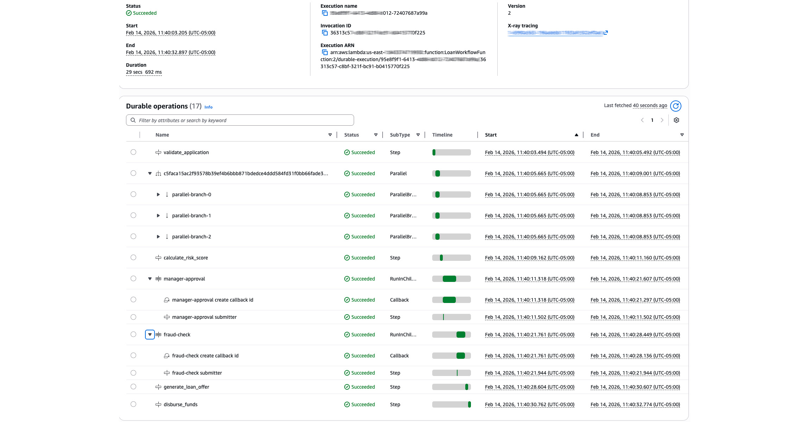
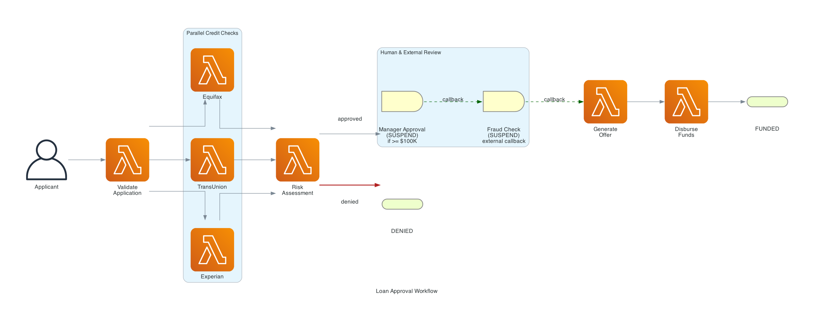

# Lambda Durable Functions Demo — Loan Approval Workflow

A complete, working example of **AWS Lambda Durable Functions** in Python with a **React frontend**, demonstrating checkpoint/replay, parallel execution, human-in-the-loop callbacks (manager approval + external fraud check), and real-time progress tracking through a realistic loan approval pipeline.

Built for the presentation: **"Lambda Durable Functions vs Step Functions: When Each Wins"**



## What's Inside

```
lambda-durable-demo/
├── template.yaml              # SAM template (API GW, Lambdas, DynamoDB)
├── samconfig.toml             # SAM deploy configuration
├── src/
│   ├── loan_demo.py           # Durable workflow with DynamoDB progress logging
│   ├── api.py                 # API Lambda (POST /apply, GET /status, POST /approve)
│   ├── fraud_check.py         # External fraud check Lambda (callback pattern)
│   └── requirements.txt       # Python dependencies
└── frontend/
    ├── package.json
    ├── vite.config.js
    ├── index.html
    ├── .env                   # API URL (set after deploy)
    └── src/
        ├── main.jsx
        ├── App.jsx
        └── App.css
```

## Features Demonstrated

| Feature | Where | Description |
|---------|-------|-------------|
| `@durable_step` | `loan_demo.py` | Checkpointed business logic units |
| `@durable_execution` | `loan_demo.py` | Durable workflow handler |
| `context.step()` | `loan_demo.py` | Execute and checkpoint a step |
| `context.parallel()` | `loan_demo.py` | Concurrent credit bureau checks (3 bureaus) |
| `context.wait_for_callback()` | `loan_demo.py` | Manager approval + external fraud check |
| Callback pattern | `fraud_check.py` | External service sends callback to resume workflow |
| Real-time progress | `api.py` | DynamoDB-backed progress polling from React frontend |
| Replay detection | `loan_demo.py` | Counter-based `[REPLAY]` tagging on re-executed log entries |
| Structured logging | All functions | Powertools Logger with JSON output and correlation IDs |
| X-Ray tracing | `api.py`, `fraud_check.py` | Powertools Tracer with method-level subsegments |
| CloudWatch metrics | `api.py` | Powertools Metrics (ApplicationsSubmitted, ApprovalsProcessed) |

## Workflow



## Demo Profiles

Three hardcoded profiles produce predictable outcomes:

| Profile | SIN (last 4) | Default Amount | Outcome |
|---------|-------------|----------------|---------|
| Alice Johnson | 1111 | $150,000 | Always approved (triggers manager approval) |
| Bob Martinez | 2222 | $50,000 | Always denied (credit score too low) |
| Charlie Wilson | 3333 | $25,000 | Approved if <= $25,000, denied if above |

## Prerequisites

- Python 3.13+
- Node.js 18+
- [AWS SAM CLI](https://docs.aws.amazon.com/serverless-application-model/) v1.150.1+
- AWS account with Lambda access

## Quick Start

### 1. Build & Deploy Backend

```bash
sam build
sam deploy --guided   # first time
sam deploy            # subsequent deploys
```

Note the `LoanApiUrl` output — you'll need it for the frontend.

### 2. Configure & Run Frontend

```bash
cd frontend
npm install

# Set the API URL from the deploy output
echo "VITE_API_URL=https://YOUR-API-ID.execute-api.us-east-1.amazonaws.com" > .env

npm run dev
```

The frontend runs at `http://localhost:5173`.

### 3. Try It

1. Click a demo profile (Alice, Bob, or Charlie) to pre-fill the form
2. Click **Submit Application**
3. Watch the step indicator and logs update in real-time
4. For Alice ($150K): a manager approval modal appears — approve or deny
5. The fraud check runs automatically via an external Lambda callback

## Architecture


## Observability (Powertools)

All functions use [AWS Lambda Powertools for Python](https://docs.powertools.aws.dev/lambda/python/latest/) for structured observability:

- **Logger**: JSON-structured logs with correlation IDs and `application_id` context
- **Tracer**: X-Ray tracing with method-level subsegments (on `api.py` and `fraud_check.py` — not on `loan_demo.py` because `@durable_execution` replay would create misleading traces)
- **Metrics**: CloudWatch EMF metrics for `ApplicationsSubmitted`, `ApprovalsProcessed`, and `ColdStart` (on `api.py` only)

## Key Concepts

### Checkpoint & Replay

When a durable function resumes after a callback or failure, the handler **re-executes from the top**. Completed steps return their **cached checkpoint results** instead of re-executing. This is why:

- Code must be **deterministic** (same operation order every time)
- Non-deterministic values (timestamps, random) must be **inside steps**
- Side effects **must be inside steps** (or they'll repeat on replay)

### Callback Pattern

The workflow uses `context.wait_for_callback()` in two places:

1. **Manager approval** — the workflow suspends and stores a `callback_id` in DynamoDB. The frontend reads it and sends the approval via the API.
2. **Fraud check** — the workflow invokes an external Lambda (`fraud_check.py`) which processes the request and calls `send_durable_execution_callback_success` to resume the workflow.

In both cases, the Lambda uses **zero compute** while waiting.

### Qualified ARN Requirement

Durable functions **must** be invoked with a qualified ARN (version or alias). This ensures replay uses the same code version that started the execution. The template uses `AutoPublishAlias: live` to handle this automatically.

## Resources

- [Lambda Durable Functions Documentation](https://docs.aws.amazon.com/lambda/latest/dg/durable-functions.html)
- [Durable Execution SDK (Python)](https://github.com/aws/aws-durable-execution-sdk-python)
- [Best Practices](https://docs.aws.amazon.com/lambda/latest/dg/durable-best-practices.html)
